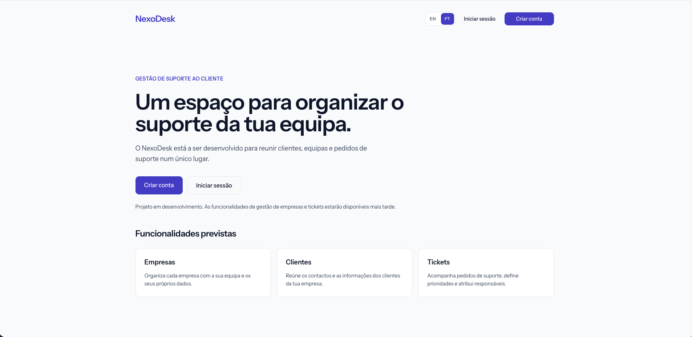

# NexoDesk

A SaaS application for managing customer support tickets across companies.

Built as a portfolio and learning project with Laravel, Vue and TypeScript,
with a focus on maintainable code, authorization and automated testing.

> Work in progress. The project currently includes the application foundation.
> Company management and ticket workflows are not implemented yet.

## Preview

## Tech stack

- Laravel 13 and PHP
- Vue 3 and TypeScript
- Inertia.js 3
- Tailwind CSS 4
- Vue I18n
- Pest
- Laravel Wayfinder
- Vite Plus

## Current progress

- Laravel Vue starter kit with authentication.
- Shared color palette with light and dark theme tokens.
- Frontend translation setup for English and Portuguese (Portugal).
- Language switcher with the selected locale stored in the session.
- Laravel and Vue locale synchronization.
- Portuguese backend translations through Laravel Lang.
- Server-side validation of supported locales.

The language infrastructure is working. Translation of all application
screens is still in progress.

## Roadmap

- [x] Set up the Laravel and Vue application
- [x] Define the application color palette
- [x] Implement language selection and persistence
- [x] Add Portuguese backend translations
- [x] Test the locale selection flow
- [x] Build the NexoDesk welcome page
- [ ] Document and configure continuous integration
- [ ] Implement company registration and membership
- [ ] Add invitations and company roles
- [ ] Implement customer management
- [ ] Implement ticket creation, assignment and status updates
- [ ] Enforce company data isolation and authorization
- [ ] Test the main application workflows
- [ ] Deploy a public demo

## Local development

The project is developed locally using Laravel Herd.

After cloning the repository, install the dependencies:

    composer install
    npm ci

Create the environment file and generate the application key:

    cp .env.example .env
    php artisan key:generate

Configure the database connection in `.env`, then run:

    php artisan migrate

Serve the project through Laravel Herd and start the frontend development
server:

    npm run dev

Open the local URL assigned by Herd.

## Development checks

Check frontend formatting and linting:

    npm run check

Apply automatic fixes:

    npm run check:fix

Check TypeScript types:

    npm run types:check

Run backend tests:

    php artisan test

Create a production frontend build:

    npm run build

## Localization

The application uses a single language preference stored in the Laravel
session.

- Vue interface translations: `resources/js/locales/en.json` and
  `resources/js/locales/pt-PT.json`.
- Laravel backend translations: `lang/en`, `lang/pt` and language JSON
  files where applicable.
- Locale mapping: `config/localization.php`.

The frontend uses `pt-PT` for Portuguese (Portugal), mapped to `pt`
on the backend to match the Laravel Lang translation files.

`SetLocale` applies the backend locale for each web request.
`HandleInertiaRequests` shares the locale with Vue, and Vue I18n updates
the interface when that value changes.

Custom application text must be added to the appropriate translation files.

## Security approach

Security is part of the development process. Planned company and ticket
features will require server-side authorization and tests for data isolation.

Environment files, credentials and application secrets must not be committed.
The `.env.example` file should contain placeholders and safe defaults only.

This project is under active development and is not ready for production use.

## Author

Alona Costa
